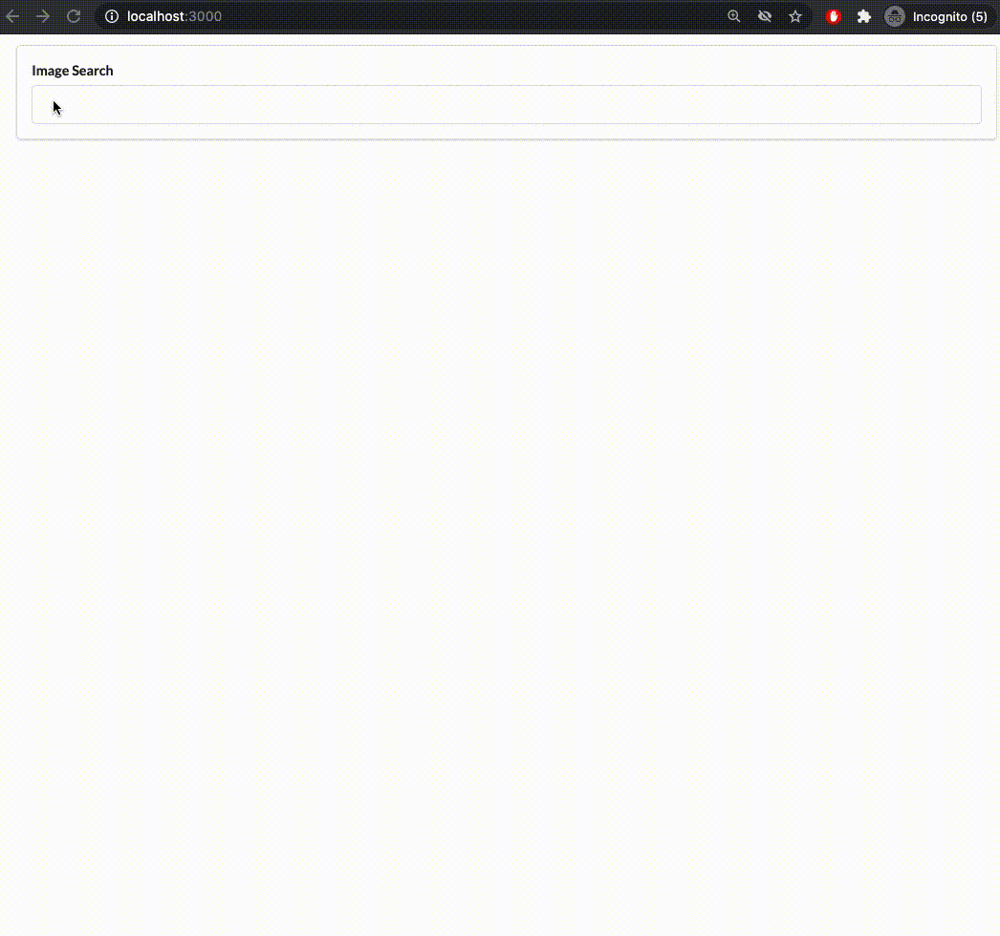

## Simple image search application

A simple React application, a basic version of Google Images.

The aim is to demonstrate an understanding of the following concepts:

1. Key React concepts eg. components and props, state and lifecycle methods, handling user input from forms, [controlled components](https://reactjs.org/docs/forms.html#controlled-components)...
2. [Refs](https://reactjs.org/docs/refs-and-the-dom.html) for reactive rendering based on the size of images (each image can have a different size which isn't known until the image is returned by the API, so a simple CSS grid won't suffice). A ref will reach into the DOM to obtain the height of an image (something like document.querySelector('...')), pass it to the child ImageCard component as a prop, and re-render it with the appropriate height.
3. AJAX requests (just a simple GET request via axios).

The search function relies on the [Unsplash](https://www.unsplash.com) API. Create a free account and export your API key from your profile, eg. `~/.bash_profile`, as a variable with the name `UNSPLASH_API_KEY`. This key will be used in the file `src/api/unsplash.js`.

### Demo



### Deployment

To run this app in dev, clone this repo, then from the root directory:

```bash
npm i
npm start
```

The app will run in `http://localhost:3000`.

### Terms and Credits

See [Unsplash's](https://unsplash.com/license) fair use terms.

This project is based on [Stephen Grider's course](https://www.udemy.com/course/react-redux/).
